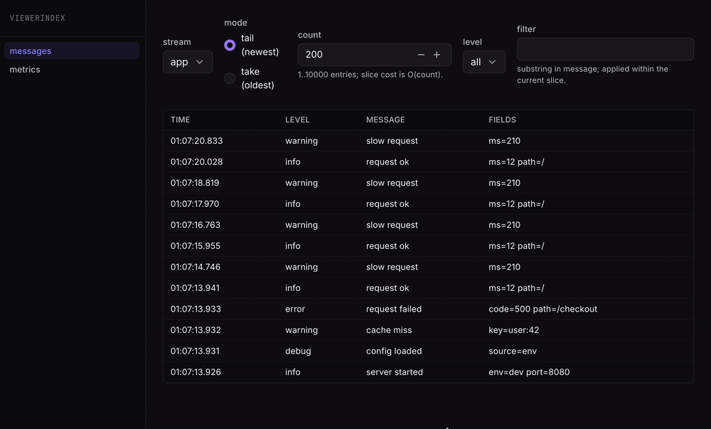

<div align="center">
  <h1>nulog</h1>
  <h3>Fast, serverless logger built on <a href="https://github.com/nustackdev/nu">Nu</a>, for infinite-scale streams</h3>

  [](https://github.com/nustackdev/nu)
  [](https://pypi.org/project/nulog/)
  [](https://pypi.org/project/nulog/)

  <br/>

  
</div>

<br/>

- Append-only logs and metric series in one library.
- Serverless and in-process - no daemon, no extra service to run.
- Billions of entries per stream, reads stay fast at any size.
- Live browser dashboard, zero setup.
- Filter and sample any stream from the UI.

## Installation

Requires Python 3.10+.

```bash
pip install nulog
```

## Usage

Two flavors of the same store - pick whichever fits the call site.

### Plain Python

```python
import nulog

log = nulog.init("logs.db")  # `with nulog.init() as log:` works too.

log.info("server started", stream="app", extra={"port": 8080})
log.warning("cache miss", stream="app", extra={"key": "user:42"})
log.error("request failed", stream="app", extra={"path": "/checkout"})
log.observe("cpu_load", 0.42)

print(log.tail("app", 3))
print(log.sample("cpu_load", 10))

log.close()
```

### Native Nu

```python
import nu, nulog

app = nulog.getLogger("app")

tree = nu.With(nulog.store(),
    body=nu.kv.Transaction(
        app.info("server started", extra={"port": 8080})
        >> app.warning("cache miss", extra={"key": "user:42"})
        >> app.error("request failed", extra={"path": "/checkout"})
        >> nulog.observe("cpu_load", 0.42),
    )
    >> nu.kv.Snapshot(nu.print("tail:", nulog.messages.tail("app", 3)))
    >> nu.kv.Snapshot(nu.print("cpu:", nulog.metrics.sample("cpu_load", 10))),
)

nu.run(tree)
```

Read atoms both flavors expose:

- Messages: `tail(stream, n)`, `slice(stream, start, stop, step=1)`.
- Metrics: `range(name, begin_us, end_us)`, `sample(name, n, begin_us=None, end_us=None)`.

Log rows: `{"ts_us": int, "level": str, "msg": str, "fields": dict}`.
Metric rows: `{"ts_us": int, "ts": float, "value": float}`.

## UI

A live browser dashboard: filter logs by stream, level, and text, and
chart any metric over the last minute, five minutes, hour, and up. New
streams and series show up on their own, no restart.

### Open any nulog file

```bash
nulog view logs.db
```

Then open <http://127.0.0.1:8080>. Safe on a file another process is
writing.

### Serve alongside your Nu app

Add the viewer next to your writes - one process, one port:

```python
import asyncio, nu, nulog

tree = nu.With(
    nulog.store("logs.db"),
    nulog.ui(port=8080),
    body=your_app_body,
)
asyncio.run(nu.arun(tree))
```
